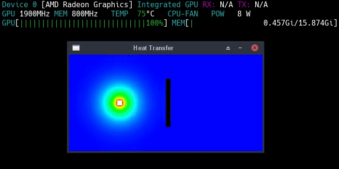

# GPU-Accelerated Heat Conduction Simulator

This is a 2D heat conduction simulator implemented in C++ using GPU acceleration. It supports NVIDIA, AMD, and Intel GPUs.

The project provides a CPU solver and two GPU-based solvers:
- **OpenCL** solver for general-purpose GPU computation
- **OpenGL** solver based on compute shaders

The simulation models heat diffusion on a rectangular grid using a finite-difference method, where each cell represents a discrete temperature value.



## Build Instructions

The project has been tested on Linux.

Required build tools:
- GCC
- GNU Make
- xxd

Required libraries:
- SFML 3
- OpenMP
- OpenCL (OpenCL header files and OpenCL ICD loader)
- OpenGL

To build the project, run the `make` command from the project's root directory:
```
make
```
## Usage

Run the simulator:
```
./build/heat-transfer cases/metal-plate.json
```

By default, the CPU solver is used.

To use the GPU solver based on OpenCL, run:
```
./build/heat-transfer cases/metal-plate.json -s opencl
```

To use the GPU solver based on OpenGL, run:
```
./build/heat-transfer cases/metal-plate.json -s opengl
```

Another example case:
```
./build/heat-transfer cases/water.json
```

If the rendering window is too small, use `-z` to increase its size, for example:
```
./build/heat-transfer cases/water.json -z 4
```

For more information, run:
```
./build/heat-transfer --help
```

Controls:
- `Esc` - close the window
- `R` - reset the simulation
- `H` - toggle the HUD
- `V` - toggle the velocity field
